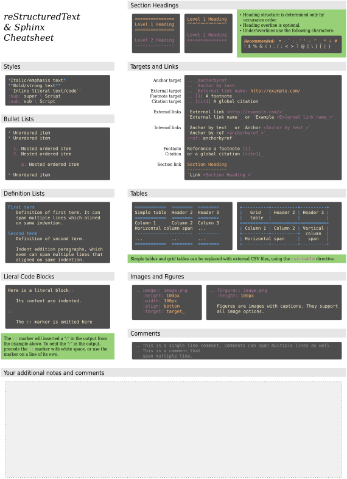
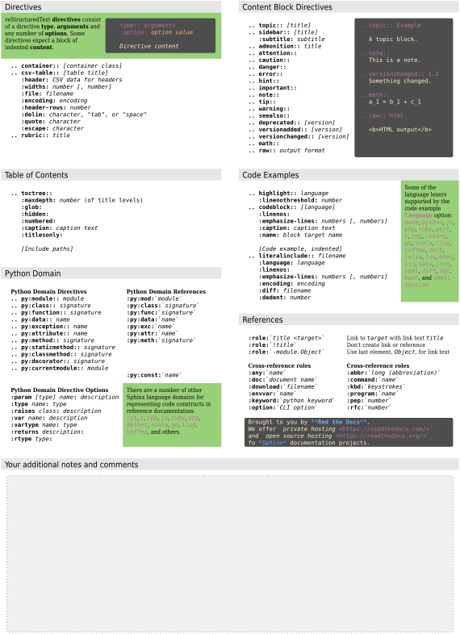

:topic: Cheat Sheet

###########
Cheat Sheet
###########

.. only:: html

   .. sectionauthor:: |slz_obfuscated|

.. only:: latex or man or texinfo or text

   .. sectionauthor:: |slz_plain_text|

We have made a cheat sheet for helping you remember the syntax for
|reStructuredText| & |Sphinx| programs. The basic
:duuser:`reStructuredText Cheat Sheet <cheatsheet>`
could also be very helpful.

.. _cheat-sheet-rst-sphinx-front:

   *Cheat Sheet* **reStructuredText & Sphinx 1/2**

:raw-latex:`\FloatBarrier`

.. _cheat-sheet-rst-sphinx-back:

   *Cheat Sheet* **reStructuredText & Sphinx 2/2**

:raw-latex:`\FloatBarrier`

.. Local variables:
   coding: utf-8
   mode: text
   mode: rst
   End:
   vim: fileencoding=utf-8 filetype=rst :
